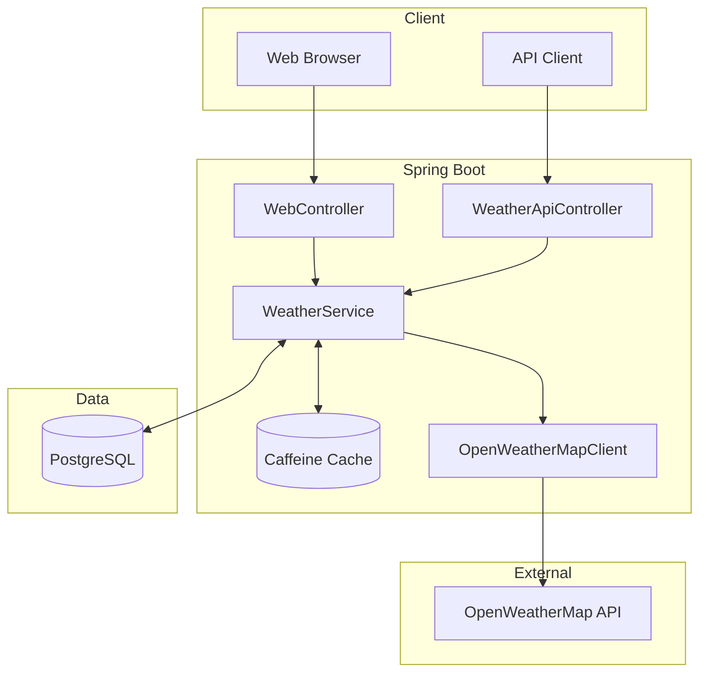

# Weather Forecast Service

A Spring Boot application that provides current weather and 5-day forecasts via REST API and web interface, powered by OpenWeatherMap.

## Tech Stack

<p>
  
  
  
  
  
  
</p>

## Architecture



## How to Run

```bash
# Clone and configure
git clone https://github.com/RidwanWaheed/weather-forecast-service.git
cd weather-forecast-service
cp .env.example .env
# Edit .env and add your OpenWeatherMap API key

# Run with Docker
make up

# Or run locally (requires PostgreSQL)
./mvnw spring-boot:run
```

Access: http://localhost:8080 | API Docs: http://localhost:8080/swagger-ui.html

## API Endpoints

| Method | Endpoint | Description |
|--------|----------|-------------|
| GET | `/api/weather/current?city={name}` | Current weather |
| GET | `/api/weather/forecast?city={name}` | 5-day forecast |

## Make Commands

```bash
make up      # Start containers
make down    # Stop containers
make dev     # Development mode with hot reload
make test    # Run tests
make logs    # View logs
```
